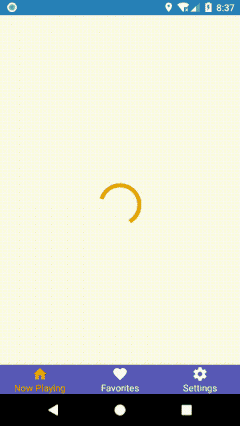
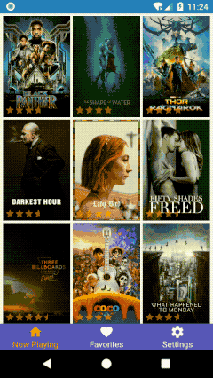
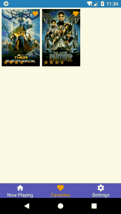
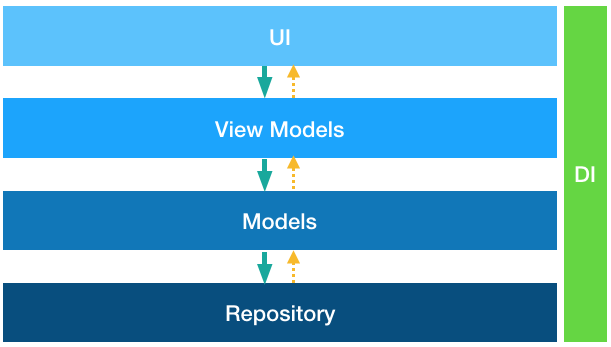
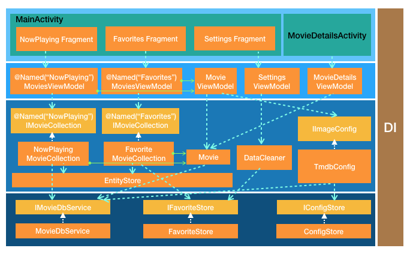

# Android App Architecture Demo - MVVM with databinding (Kotlin version) [[Java version](https://github.com/BrianSpace/Android-App-Architecture-MVVM-Databinding/tree/master)] [[中文版](README_zh.md)]
This is a sample project to demonstrate the Android application architecture with MVVM pattern, a simple client for [The Movie DB](https://www.themoviedb.org/) web API.

## Table of Contents
 - [Why MVVM?](#why-mvvm)
 - [Screenshots](#screenshots)
 - [Application Introduction](#application-introduction)
 - [Application Architecture](#application-architecture)
    - [Architecture Layers](#architecture-layers)
    - [Major Components](#major-components)
    - [Design decisions for the application](#design-decisions-for-the-application)
    - [Module/Directory Structure (Development View)](#moduledirectory-structure-development-view)
 - [Get started](#get-started)
 - [Reusable Components](#reusable-components)
    - [Common](#common)
    - [Data Binding](#data-binding)
    - [UI Layer](#ui-layer)
 - [External Libraries/Frameworks/Widgets](#external-librariesframeworkswidgets)
 - [Code Quality](#code-quality)
 - [Notes](#notes)
 - [License](#license)

## Why [MVVM](https://en.wikipedia.org/wiki/Model%E2%80%93view%E2%80%93viewmodel)?
For client application development, MVVM is better than other MV* patterns like MVC or MVP. 

Why? Because a view model, as the extra abstraction of the view's data and behavior, has a higher abstraction level than other MV* patterns. Furthermore, view models are totally decoupled from views through databinding. The higher abstraction level and more complete decoupling lead to a cleaner architecture.

Any benefit comes with a cost, the abstraction and separation are not free. For projects that are complex enough, these initial cost will pay off soon. But for simple applications, it may be overkill.

For this demo project, using MVVM seems a little bit over engineering. But my purpose here is to demonstrate with a working example that is not too simple, and dealing with real problems in a real project. Furthermore, for a project whose goal is a full featured application like the client for "The Movie DB", this will be a good start.

## Screenshots

  

## Application Introduction
The application has the following features:
* The main page has three tabs: Now Playing, Favorite and Settings.
* The Now Playing tab displaying the movies now playing.
    * Each movie is shown as a poster picture in the grid, with rating stars and favorite state icon on top of it.
    * You can pull down the list to refresh and pull up at the end to load the next page.
* The Favorite tab shows the local favorite list and has the same functionality as the Now Playing tab.
* Click on the movie poster will navigate to the movie details page, in which additional details like backdrop image, tagline and similar movies will be shown.
    * The float action button in the page shows a progress circle animation while loading and the favorite state icons will show after loading. You can click the favorite icon to add to or remove from local favorite movie list.
    * You can pull up the similar movies list to load the next page.
* In settings page, you can clear the cached HTTP responses, images, as well as local favorites.
## Application Architecture
### Architecture Layers

* Dependency
    * Unidirectional dependency from top-down. Lower layer communite with upper layer through various notification means:
        * View Models notify UI through databinding.
        * Models notify View Models through observable notification events.
        * Repository layer just returns values through RxJava event sources to Models.
    * Dependencies are injected by the DI (dependency injection) framework. View Models layer and Models layer components are all unit testable.
* View models layer should have no dependency on UI components, and depend on Android as less as possible. (Current dependencies are the Android databinding framework, AndroidSchedulers from RxAndroid, and SparseArray.)
* Models layer is the domain model for the application and should be UI and platform independent, i.e. depend on neither the interaction/UI design nor the Android platform. (Currently it depends on SparseArray just for performance reason, and can be replaced if needed.)
* Repository layer is the abstraction for data access to local storage (Shared Preferences, SQLite databases) and external Web APIs.
### Major Components


Most of the classe names are obvious. For those not very obvious:
* [`TmdbConfig`](app/src/main/java/com/github/brianspace/moviebrowser/models/TmdbConfig.java): the class used to get the TMDb configurations. See <https://developers.themoviedb.org/3/configuration/get-api-configuration>. [`IImageConfig`](app/src/main/java/com/github/brianspace/moviebrowser/models/IImageConfig.java) is the interface for View Models to get image path configurations.
* [`EntityStore`](app/src/main/java/com/github/brianspace/moviebrowser/models/EntityStore.java): the object store to hold the (weak) references of model layer entities.
* [`DataCleaner`](app/src/main/java/com/github/brianspace/moviebrowser/models/DataCleaner.java): use to clear application cache for HTTP, image as well as local database.
* [`IConfigStore`](app/src/main/java/com/github/brianspace/moviebrowser/repository/IConfigStore.java): used to access configuration storage.
* [`IFavoriteStore`](app/src/main/java/com/github/brianspace/moviebrowser/repository/IFavoriteStore.java): used to access favorite movies.
* [`IMovieDbService`](app/src/main/java/com/github/brianspace/moviebrowser/repository/IMovieDbService.java): used to access the Web API of "The Movie DB".
### Design decisions for the application
1. Model-View-ViewModel (MVVM) architecture: which takes advantage of the native [Android data-binding support](https://developer.android.com/topic/libraries/data-binding/index.html).
2. Decouple with Dependency Injection: using [Dagger-2](http://google.github.io/dagger/).
3. Asynchrony: I/O operations should run in background with [RxJava](https://github.com/ReactiveX/RxJava)+[RxAndroid](https://github.com/ReactiveX/RxAndroid).
4. Activity navigation: URI based, decouple the activities. Implemented in [NavigationHelper](app/src/main/java/com/github/brianspace/moviebrowser/ui/nav/NavigationHelper.java).
5. Object Lifecycle
    * Entities in model layer are saved in the [EntityStore](app/src/main/java/com/github/brianspace/moviebrowser/models/EntityStore.java) (as WeakReferences to prevent memory leaks) which ensures the uniqueness (one object instance for each movie) so that different views of the same entity can be kept in sync through change notifications.
    * View models have the same lifetime as the corresponding views. They have one to one mapping to the views displayed. Otherwise the different lifetime will be very confusing and cause more problems than benefits (believe me, I tried that in the beginning).
### Module/Directory Structure (Development View)
As the development view of the application architecture, it is an essential part to have a clear separation into modules and directory structure (packages in Java).
* Modules division
    - app: main application module.
    - lib-common: common functionality
    - lib-databinding: databinding support
    - lib-widgets: reusable UI widgets
* Directory structure in App module
    - di: dependency injection
        - components: [Component](https://google.github.io/dagger/api/latest/dagger/Component.html) and [Subcomponent](https://google.github.io/dagger/subcomponents) for Dagger.
        - modules: [Module](https://google.github.io/dagger/api/latest/dagger/Module.html) for Dagger.
        - qualifiers: qualification specifiers for dependency injection.
    - models: Model layer classes.
    - repository: data access layer
        - data: value objects used for JSON deserialization.
        - local: local storage, including SharedPreferences and SQLite databases.
        - util: utility classes.
        - web: to access Web API of TMDb.
    - ui: UI layer classes.
        - activity: Activities in the application.
        - databinding: BindingAdapters for databinding.
        - fragment: Fragments in the application.
        - nav: utility class NavigationHelper.
        - view: application related UI controls.
    - viewmodels: View Model layer classes.
* Directory structure in Common module
    - objstore: object stor
    - observable: observable patter inplementation for objects and collections.
    - util: utility classes.
* Directory structure in Databinding module
    - adapter: list adapter for RecyclerView, supporting binding to ObservableList.
    - message: display notifications through databinding, so that view model can show notifications (Toast for now) without depending on UI controls.
* Directory structure in Widgets module
    - behaviors: behaviros for CoordinatorLayout.
    - utils: utility classes. ImageLoader for now.
    - widgets: project independent, reusable UI controls.
## Get started
Before you can run the application, you need to register a developer account following the [TMDb introductions](https://developers.themoviedb.org/3/getting-started/introduction) and get the API key. Then add the API key in the project's `gradle.properties` file:
```properties
# API Key for the TMDb API
API_KEY="xxxxx"
```
Reference: <https://developers.themoviedb.org/3/getting-started/authentication>
## Reusable Components
Project independent reusable components are developed in separate modules.
### Common
* [Observables](lib-common/src/main/java/com/github/brianspace/common/observable): enable obsever registrations (with weak references) and event notifications.
* [ObjectStore](lib-common/src/main/java/com/github/brianspace/common/util/ObjectStore.java) and [ModelObjectStore](lib-common/src/main/java/com/github/brianspace/common/util/ModelObjectStore.java): thread-safe object store which ensures that only one object will be associated with one key.
### Data Binding
* [RecyclerViewDatabindingAdapter](lib-databinding/src/main/java/com/github/brianspace/databinding/adapter/RecyclerViewDatabindingAdapter.java): RecyclerView adapter which support data binding to an ObservableList.
* [HeaderedRecyclerViewDatabindingAdapter](lib-databinding/src/main/java/com/github/brianspace/databinding/adapter/HeaderedRecyclerViewDatabindingAdapter.java): RecyclerView adapter which support data binding to an ObservableList, with a header binding to an object outside the list.
### UI Layer
* [DynamicGridView](lib-widgets/src/main/java/com/github/brianspace/widgets/DynamicGridView.java):  RecyclerView based Grid view that can automatically adjust number of columns based on available width and specified cell width. Gaps between cells are carefully caculated so that they are spanned evenly, while the header can occupy the full width.
* [FixedAspectRatioImage](lib-widgets/src/main/java/com/github/brianspace/widgets/FixedAspectRatioImage.java): AppCompatImageView with fixed aspect ratio (set through an attribut).
* [ImageLoader](lib-widgets/src/main/java/com/github/brianspace/utils/ImageLoader.java): load image with Glide. Can load image after the ImageView is measured.
* [AutoHideWhenScrollDownBehavior](lib-widgets/src/main/java/com/github/brianspace/behaviors/AutoHideWhenScrollDownBehavior.java): A CoordinatorLayout behavior for the target view (e.g. `BottomNavigationView`) to auto hide when scroll down.

## External Libraries/Frameworks/Widgets
The usage of the following well know libraries/frameworks/widgets are demonstrated in this project:
* [Dagger-2](http://google.github.io/dagger/) for dependency injection, including its convenient [AndroidInjector](https://google.github.io/dagger/android.html) for Android components. It is based on code generation instead of reflection so it works like a charm with code obfuscations like ProGuard for Android.
* RFP (Reactive Functional Programming) and Asynchrony: [RxJava](https://github.com/ReactiveX/RxJava) with [RxAndroid](https://github.com/ReactiveX/RxAndroid).
* Restful client: [Retrofit](https://square.github.io/retrofit/) + [OkHttp](http://square.github.io/okhttp/) + [RxJava](https://github.com/ReactiveX/RxJava) + [GSON](https://github.com/google/gson).
* ORM framework: [Room](https://developer.android.com/topic/libraries/architecture/room.html)
* Widgets:
    * [CoordinatorLayout](https://developer.android.com/reference/android/support/design/widget/CoordinatorLayout.html) + [AppBarLayout](https://developer.android.com/reference/android/support/design/widget/AppBarLayout.html) + [CollapsingToolbarLayout](https://developer.android.com/reference/android/support/design/widget/CollapsingToolbarLayout.html) + [FloatingActionButton](https://developer.android.com/reference/android/support/design/widget/FloatingActionButton.html)
    * [CoordinatorLayout](https://developer.android.com/reference/android/support/design/widget/CoordinatorLayout.html) + [BottomNavigationView](https://developer.android.com/reference/android/support/design/widget/BottomNavigationView.html) with [AutoHideWhenScrollDownBehavior](lib-widgets/src/main/java/com/behaviors/AutoHideWhenScrollDownBehavior.java)
    * [ConstraintLayout](https://developer.android.com/reference/android/support/constraint/ConstraintLayout.html)
    * [RecyclerView](https://developer.android.com/reference/android/support/v7/widget/RecyclerView.html)
* Image loading with [Glide](https://github.com/bumptech/glide)
* View binding: [Butterknife](https://github.com/JakeWharton/butterknife), used to avoid `findViewById`.
* Unit test frameworks:
  * [Mockito](https://github.com/mockito/mockito) mock framework
  * [Robolectric](http://robolectric.org/) unit test framework which run unit tests depending on Android SDK, locally.
* Browser SQLite databases and SharedPreferences: [Android-Debug-Database](https://github.com/amitshekhariitbhu/Android-Debug-Database)
## Code Quality
In order to ensure the code quality, the following project is use (as a submodule) in this application:
* Static code analysis using CheckStyle, FindBugs, Lint and PMD: [Android-Quality-Essentials](https://github.com/BrianSpace/Android-Quality-Essentials).

## Notes
The signing configs comes from the project's `gradle.properties` file. You should add the following if you would like to sign the APK with your own key:
```properties
# signingConfigs for release build
RELEASE_STORE_FILE=xxx.xxx
RELEASE_STORE_PASSWORD=xxx
RELEASE_KEY_ALIAS=xxx
RELEASE_KEY_PASSWORD=xxx
```

License
=======

  Copyright (C) 2018, Brian He
 
  Licensed under the Apache License, Version 2.0 (the "License");
  you may not use this file except in compliance with the License.
  You may obtain a copy of the License at
 
       http://www.apache.org/licenses/LICENSE-2.0
 
  Unless required by applicable law or agreed to in writing, software
  distributed under the License is distributed on an "AS IS" BASIS,
  WITHOUT WARRANTIES OR CONDITIONS OF ANY KIND, either express or implied.
  See the License for the specific language governing permissions and
  limitations under the License.

